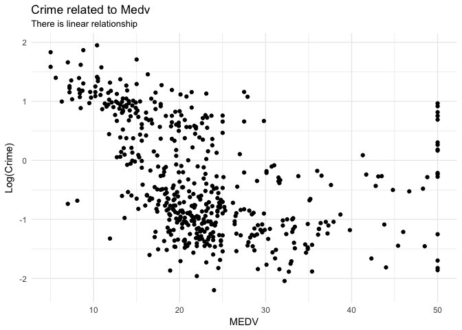
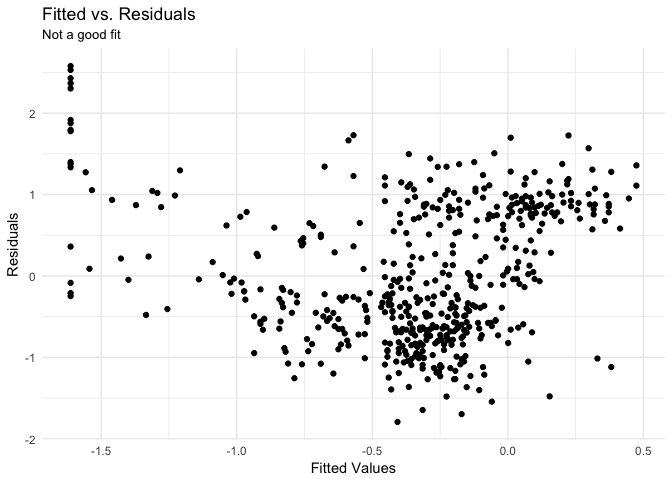
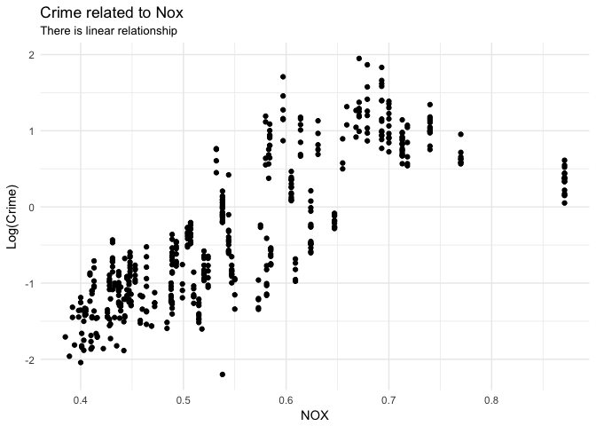
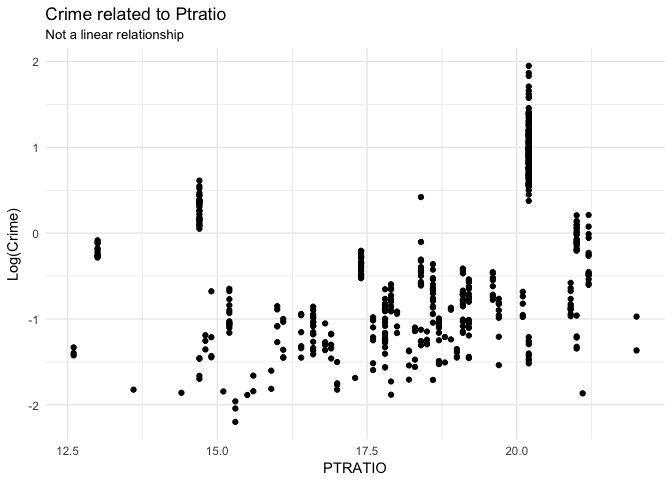
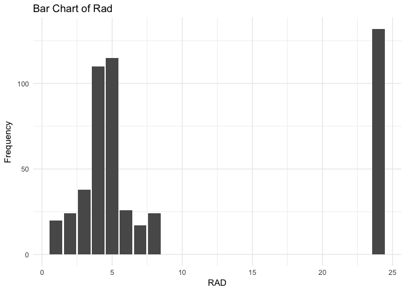
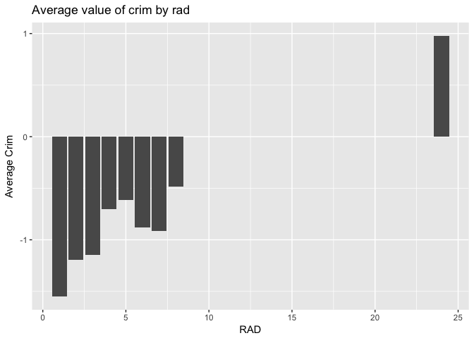
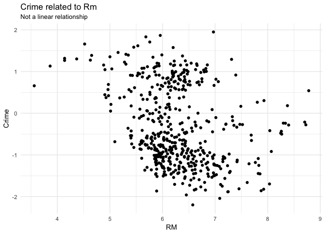
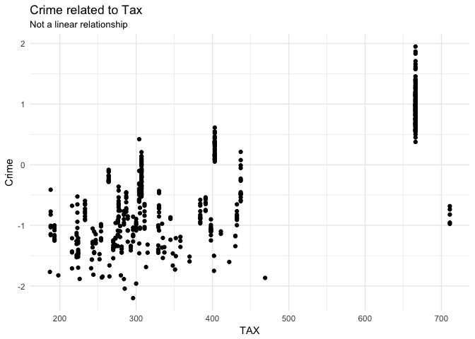
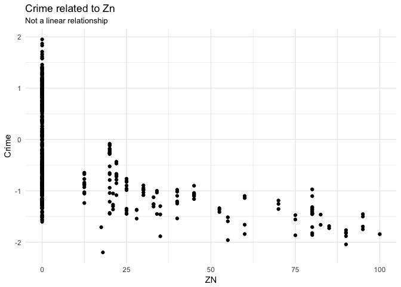
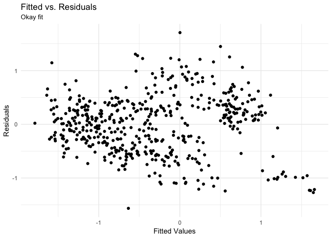

Statistics B8IT103 Continuous Assignment
================
Azmir Fakkri 10383721
10/11/2017

(A) Descriptive Statistics
==========================

| variable\_name | type    |  count\_unique|  count\_blank|  count\_zero|     median|         mean|      std.dev|
|:---------------|:--------|--------------:|-------------:|------------:|----------:|------------:|------------:|
| age            | numeric |            356|             0|            0|   77.50000|   68.5749012|   28.1488614|
| black          | numeric |            357|             0|            0|  391.44000|  356.6740316|   91.2948644|
| chas           | numeric |              2|             0|          471|    0.00000|    0.0691700|    0.2539940|
| crim           | numeric |            504|             0|            0|    0.25651|    3.6135236|    8.6015451|
| dis            | numeric |            412|             0|            0|    3.20745|    3.7950427|    2.1057101|
| indus          | numeric |             76|             0|            0|    9.69000|   11.1367787|    6.8603529|
| lstat          | numeric |            455|             0|            0|   11.36000|   12.6530632|    7.1410615|
| medv           | numeric |            229|             0|            0|   21.20000|   22.5328063|    9.1971041|
| nox            | numeric |             81|             0|            0|    0.53800|    0.5546951|    0.1158777|
| ptratio        | numeric |             46|             0|            0|   19.05000|   18.4555336|    2.1649455|
| rad            | numeric |              9|             0|            0|    5.00000|    9.5494071|    8.7072594|
| rm             | numeric |            446|             0|            0|    6.20850|    6.2846344|    0.7026171|
| tax            | numeric |             66|             0|            0|  330.00000|  408.2371542|  168.5371161|
| zn             | numeric |             26|             0|          372|    0.00000|   11.3636364|   23.3224530|

(B) Linear Regressions
======================

age
---

Age refers to the proportion of owner-occupied units built prior to 1940.

The plot shows the relationship between crime and age.

There is a linear relationship.

### Age Model Statistics & Coefficients

|  r.squared|  adj.r.squared|      sigma|  statistic|  p.value|   df|     logLik|      AIC|      BIC|  deviance|  df.residual|
|----------:|--------------:|----------:|----------:|--------:|----:|----------:|--------:|--------:|---------:|------------:|
|  0.4333373|      0.4322129|  0.7075267|   385.4179|        0|    2|  -541.9151|  1089.83|  1102.51|  252.2994|          504|

The age model accounts for approximately 43% of the variance seen in log10(crime). It is statistically significant with a p-value less than 0.05.

| term        |    estimate|  std.error|  statistic|  p.value|
|:------------|-----------:|----------:|----------:|--------:|
| (Intercept) |  -1.8447398|  0.0828998|  -22.25265|        0|
| age         |   0.0219585|  0.0011185|   19.63206|        0|

It is estimated that an increase in one unit of age (year) increases the log10 of crime rate by 0.02.

### Age Residual Plot

The residual plot does not display an even distribution around the 0 for the fitted values. There may be some underlying influence on the plot on the variable log10(crime).

black
-----

Black refers to 1000(Bk - 0.63)^2 where Bk is the proportion of blacks by town.

The plot shows the relationship between crime and black.

The relationship is not linear. It does not look good for regression model.

chas
----

Chas refers to Charles River dummy variable (= 1 if tract bounds river; 0 otherwise).

The plot shows the relationship between crime and chas.

From the boxplot, chas = 0 has way more crime.

The null and alternative hypotheses are:

H0: u1 = u2

H1: Not all means are equal

    ##              Df Sum Sq Mean Sq F value Pr(>F)
    ## chas          1    117   116.7   1.579  0.209
    ## Residuals   504  37247    73.9

The results showed F(1, 504) = 1.579, p&gt;.05. We cannot reject the null hypothesis and chas is not statistically significant in determining the crime rate.

dis
---

Dis refers to weighted mean of distances to five Boston employment centres.

The plot shows the relationship between crime and dis.

There is a linear relationship.

### Distance Model Statistics & Coefficient

|  r.squared|  adj.r.squared|     sigma|  statistic|  p.value|   df|    logLik|       AIC|       BIC|  deviance|  df.residual|
|----------:|--------------:|---------:|----------:|--------:|----:|---------:|---------:|---------:|---------:|------------:|
|  0.4649919|      0.4639304|  0.687481|   438.0419|        0|    2|  -527.372|  1060.744|  1073.424|  238.2056|          504|

The distance model accounts for approximately 46% of variance seen in log10(crime). It is statistically significant with p-value less than 0.05.

| term        |    estimate|  std.error|  statistic|  p.value|
|:------------|-----------:|----------:|----------:|--------:|
| (Intercept) |   0.8150212|  0.0630397|   12.92870|        0|
| dis         |  -0.3040705|  0.0145284|  -20.92945|        0|

It is estimated that an increase of one unit of distance decreases the log10 of crime rate by 0.30.

### Distance Residual Plot

The residual plot does not display an even distribution around the 0 for the fitted values. There may be some underlying influence on the plot on the variable log10(crime).

indus
-----

The plot shows the relationship between crime and the proportion of non-retail business acres per town.

The relationship is not linear. It does not look good for regression model.

lstat
-----

Lstat refers to the lower status of the population (percent).

The plot shows the relationship between crime and lstat.

There is a linear relationship.

### Lstat Model Statistics & Coefficient

|  r.squared|  adj.r.squared|      sigma|  statistic|  p.value|   df|     logLik|      AIC|       BIC|  deviance|  df.residual|
|----------:|--------------:|----------:|----------:|--------:|----:|----------:|--------:|---------:|---------:|------------:|
|  0.3926464|      0.3914413|  0.7324894|   325.8296|        0|    2|  -559.4599|  1124.92|  1137.599|  270.4165|          504|

The lstat model accounts for approximately 39% of variance seen in log10(crime). It is statistically significant with p-value less than 0.05.

| term        |    estimate|  std.error|  statistic|  p.value|
|:------------|-----------:|----------:|----------:|--------:|
| (Intercept) |  -1.3814577|  0.0663022|  -20.83578|        0|
| lstat       |   0.0823926|  0.0045645|   18.05075|        0|

It is estimated that an increase of one unit of lstat increases the log10 of crime rate by 0.08.

### Lstat Residual Plot

The residual plot does not display an even distribution around the 0 for the fitted values. There may be some underlying influence on the plot on the variable log10(crime).

medv
----

Medv refers to the median value of owner-occupied homes (in $1000s).

The plot shows the relationship between crime and medv.

There is a linear relationship.

### Medv Model Statistics & Coefficient

|  r.squared|  adj.r.squared|      sigma|  statistic|  p.value|   df|     logLik|       AIC|       BIC|  deviance|  df.residual|
|----------:|--------------:|----------:|----------:|--------:|----:|----------:|---------:|---------:|---------:|------------:|
|  0.2063903|      0.2048156|  0.8373056|   131.0729|        0|    2|  -627.1325|  1260.265|  1272.945|  353.3447|          504|

The medv model accounts for approximately 20% of variance seen in log(crime). It is statistically significant with p-value less than 0.05.

| term        |    estimate|  std.error|   statistic|  p.value|
|:------------|-----------:|----------:|-----------:|--------:|
| (Intercept) |   0.7061633|  0.0985830|    7.163136|        0|
| medv        |  -0.0463814|  0.0040512|  -11.448705|        0|

It is estimated that an increase of one unit of medv decreases the log10 of crime rate by 0.04.

### Medv Residual Plot

The residual plot does not display an even distribution around the 0 for the fitted values. There may be some underlying influence on the plot on the variable log10(crime).

nox
---

Nox refers to the nitrogen oxides concentration (parts per 10 million).

The plot shows the relationship between crime and nox.

There is a linear relationship.

### Nox Model Statistics & Coefficient

|  r.squared|  adj.r.squared|     sigma|  statistic|  p.value|   df|     logLik|       AIC|     BIC|  deviance|  df.residual|
|----------:|--------------:|---------:|----------:|--------:|----:|----------:|---------:|-------:|---------:|------------:|
|  0.6219148|      0.6211646|  1.330733|   829.0328|        0|    2|  -861.5604|  1729.121|  1741.8|  892.5091|          504|

The nox model accounts for approximately 62% of variance seen in log10(crime). It is statistically significant with p-value less than 0.05.

| term        |   estimate|  std.error|  statistic|  p.value|
|:------------|----------:|----------:|----------:|--------:|
| (Intercept) |  -8.942232|  0.2895726|  -30.88080|        0|
| nox         |  14.714024|  0.5110291|   28.79293|        0|

It is estimated that an increase of one unit of nox increases the log10 of crime rate by 14.7.

### Nox Residual Plot

The residual plot does not display an even distribution around the 0 for the fitted values. There may be some underlying influence on the plot on the variable log10(crime).

ptratio
-------

Ptratio refers to the pupil-teacher ratio by town.

The plot shows the relationship between crime and ptratio.

The relationship is not linear. It does not look good for regression model.

rad
---

Rad refers to index of accessibility to radial highways.

The bar chart shows the relationship between crime and rad.

It can be seen that accessibility index of 24 has the highest frequency.

Rad is a discrete independent variable so a linear regression model may not be suitable.

rm
--

Rm refers to average number of rooms per dwelling.

The plot shows the relationship between crime and rm.

The relationship is not linear. It does not look good for regression model.

tax
---

Tax refers to full-value property-tax rate per $10,000.

The plot shows the relationship between crime and tax.

The relationship is not linear. It does not look good for regression model.

zn
--

Zn refers to proportion of residential land zoned for lots over 25,000 sq.ft.

The plot shows the relationship between crime and zn.

The relationship is not linear. It does not look good for regression model.

(C) Multiple Regression
=======================

|  r.squared|  adj.r.squared|      sigma|  statistic|  p.value|   df|     logLik|       AIC|       BIC|  deviance|  df.residual|
|----------:|--------------:|----------:|----------:|--------:|----:|----------:|---------:|---------:|---------:|------------:|
|  0.6732796|      0.6693511|  0.5399253|   171.3833|        0|    7|  -402.5982|  821.1965|  855.0088|  145.4681|          499|

The value of r-squared in this multiple regression model, 0.67, is higher than all the single models. The conclusion that I can make from this is that, the multi-variate model is better than a bi-variate model.

| term        |    estimate|  std.error|   statistic|    p.value|
|:------------|-----------:|----------:|-----------:|----------:|
| (Intercept) |  -2.7255566|  0.3120706|  -8.7337823|  0.0000000|
| age         |   0.0012311|  0.0014545|   0.8464040|  0.3977331|
| dis         |  -0.0687681|  0.0202551|  -3.3950967|  0.0007407|
| lstat       |   0.0263694|  0.0059358|   4.4424075|  0.0000110|
| medv        |  -0.0031709|  0.0040825|  -0.7766963|  0.4377060|
| nox         |   4.1576263|  0.3692383|  11.2600071|  0.0000000|
| chas        |  -0.0758889|  0.0979751|  -0.7745737|  0.4389585|

The p-value for age, medv and chas is greater than 0.05, so they are not statistically significant in this multiple regression model. However, the model itself is statistically significant.

To answer the question, we can reject the null hypothesis for predictors with p-value&lt;0.05 which include dis, lstat and nox.

(D) Plot
========

These can be apppreciated from the plots I have created previously.

(E) Polynomial Regression
=========================

From the plots that I have created, there is evidence of non-linear association between the predictors and the response.

With polynomial regression, I will be worried about overfitting a model. This can cause p-values, R-squared and regression coefficients to be false or misleading.
