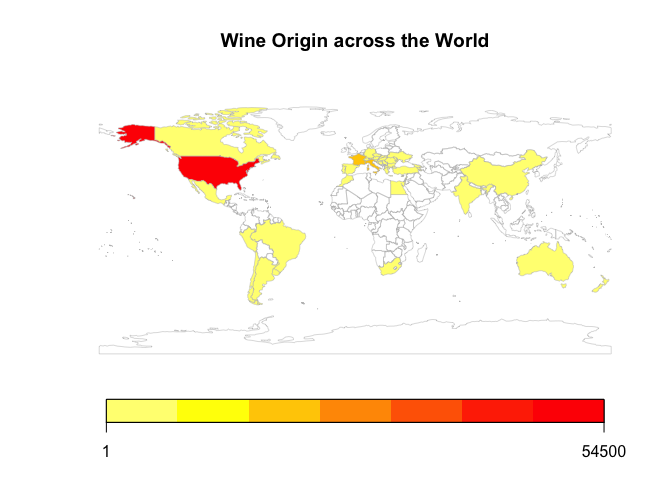
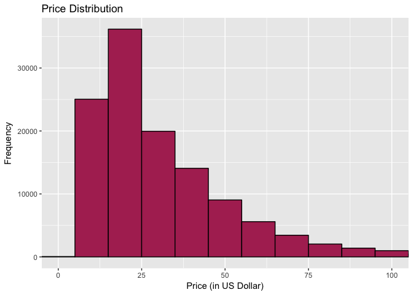
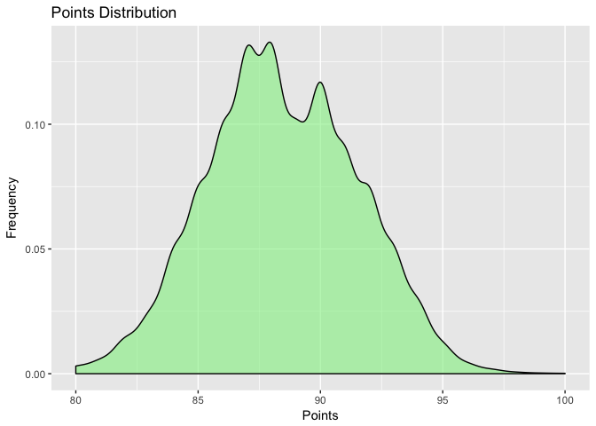
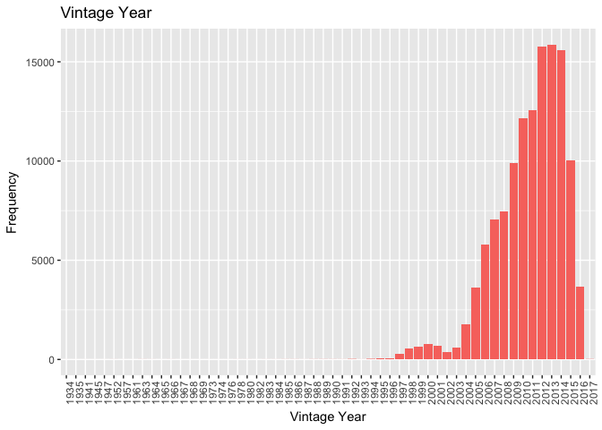
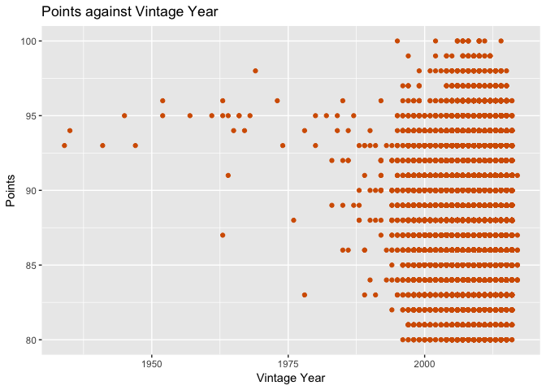

Wine Analysis
================
Azmir Fakkri
12/4/2018

Data Cleaning
=============

Noisy data needs cleaning. It can be divided into three phases, raw data exploration, data tidying and data preparation for analysis.

Raw Data Exploration
--------------------

``` r
#install and load packages
library(dplyr)
library(stringr)
library(tidyr)
library(ggplot2)
library(rworldmap)
library(ggpubr)

# Load wine_raw1 data
wine_raw1 <- read.csv(file = "https://raw.githubusercontent.com/azmirfakkri/datascience-projects/master/winemag-data-130k-v2-1.csv",
                      header = TRUE, sep = ",")

## Wine vintage year was extracted using the commented code ##
## Result were manipulated manually in Excel ##

# vintage_list <- str_extract_all(wine_tidy2$title, "\\d{4}", simplify = T)

# Load wine_raw2 (with vintage_year column)
wine_raw2 <- read.csv(file = "https://raw.githubusercontent.com/azmirfakkri/datascience-projects/master/winemag-data-130k-v2-2.csv",
                      header = TRUE, sep = ",")

# View wine_raw2 structure
str(wine_raw2)
```

    ## 'data.frame':    129971 obs. of  15 variables:
    ##  $ X                    : int  0 1 2 3 4 5 6 7 8 9 ...
    ##  $ country              : Factor w/ 44 levels "","Argentina",..: 24 33 44 44 44 39 24 17 19 17 ...
    ##  $ description          : Factor w/ 119955 levels ". A delightfully intriguing \x8a\x97\x93White Burgundy\x8a\x97\x9d blend of Chardonnay, Pinot Blanc and Pinot M"| __truncated__,..: 16430 99131 75516 60556 55752 22178 43240 89262 67632 91169 ...
    ##  $ designation          : Factor w/ 37974 levels "","??? Vineyard",..: 36972 2401 1 28199 36713 2047 3104 1 30987 20066 ...
    ##  $ points               : int  87 87 87 87 87 87 87 87 87 87 ...
    ##  $ price                : int  NA 15 14 13 65 15 16 24 12 27 ...
    ##  $ province             : Factor w/ 426 levels "","\x81_upa",..: 340 115 274 225 274 268 340 17 314 17 ...
    ##  $ region_1             : Factor w/ 1230 levels "","Abruzzo","Adelaida District",..: 426 1 1219 551 1219 759 1206 23 1 23 ...
    ##  $ region_2             : Factor w/ 18 levels "","California Other",..: 1 1 18 1 18 1 1 1 1 1 ...
    ##  $ taster_name          : Factor w/ 20 levels "","Alexander Peartree",..: 11 17 16 2 16 14 11 17 3 17 ...
    ##  $ taster_twitter_handle: Factor w/ 16 levels "","@AnneInVino",..: 6 12 9 1 9 14 6 12 1 12 ...
    ##  $ title                : Factor w/ 118840 levels ":Nota Bene 2005 Una Notte Red (Washington)",..: 79680 89460 89984 101062 102995 103761 105815 108734 54697 59330 ...
    ##  $ variety              : Factor w/ 708 levels "","\x81_ilavka",..: 694 454 440 483 444 595 191 213 213 440 ...
    ##  $ winery               : Factor w/ 16758 levels "",":Nota Bene",..: 11647 12990 13064 14434 14666 14743 15049 15437 8444 9022 ...
    ##  $ vintage_year         : int  2013 2011 2013 2013 2012 2011 2013 2012 2013 2012 ...

The wine\_raw1 data is a data frame with 129971 observations (rows) and 14 variables (columns). Some wine drinkers are interested in wine’s vintage year. Vintage year is the specified year in which the grapes are grown and harvested. This information can be extracted from the title column by specifying the rules in R using regular expressions. The new dataset is called wine\_raw2.

Data Tidying
------------

``` r
# Remove column X, taster_name and taster_twitter_handle
wine_tidy1 <- wine_raw2[ , c(-1, -10, -11)]

# Re-arrange columns 
wine_tidy2 <- select(wine_tidy1, country, designation, province, region_1, region_2, 
                     winery, variety, price, points, title, description, vintage_year)
```

Of the 15 variables, three variables are removed as they are not important for further analysis. The columns are re-arranged to give us a better view of the data.

Data Preparation for Analysis
-----------------------------

``` r
#Remove title column 
wine_data <- wine_tidy2[ , -10]

# Replace all blanks with NA
wine_data[wine_data == ""] <- NA

# Convert class of data.frame columns 
wine_data$description <- as.character(wine_data$description)
wine_data$points <- as.numeric(wine_data$points)
wine_data$price <- as.numeric(wine_data$price)

# Summary of the cleaned dataset 
summary(wine_data)
```

    ##      country            designation          province    
    ##  US      :54504   Reserve     : 2009   California:36247  
    ##  France  :22093   Estate      : 1322   Washington: 8639  
    ##  Italy   :19540   Reserva     : 1259   Bordeaux  : 5941  
    ##  Spain   : 6645   Riserva     :  698   Tuscany   : 5897  
    ##  Portugal: 5691   Estate Grown:  621   Oregon    : 5373  
    ##  (Other) :21435   (Other)     :86597   (Other)   :67811  
    ##  NA's    :   63   NA's        :37465   NA's      :   63  
    ##                  region_1                  region_2    
    ##  Napa Valley         : 4480   Central Coast    :11065  
    ##  Columbia Valley (WA): 4124   Sonoma           : 9028  
    ##  Russian River Valley: 3091   Columbia Valley  : 8103  
    ##  California          : 2629   Napa             : 6814  
    ##  Paso Robles         : 2350   Willamette Valley: 3423  
    ##  (Other)             :92050   (Other)          :12078  
    ##  NA's                :21247   NA's             :79460  
    ##                 winery                           variety     
    ##  Wines & Winemakers:   222   Pinot Noir              :13272  
    ##  Testarossa        :   218   Chardonnay              :11753  
    ##  DFJ Vinhos        :   215   Cabernet Sauvignon      : 9472  
    ##  Williams Selyem   :   211   Red Blend               : 8946  
    ##  Louis Latour      :   199   Bordeaux-style Red Blend: 6915  
    ##  (Other)           :128904   (Other)                 :79612  
    ##  NA's              :     2   NA's                    :    1  
    ##      price             points       description         vintage_year 
    ##  Min.   :   4.00   Min.   : 80.00   Length:129971      Min.   :1934  
    ##  1st Qu.:  17.00   1st Qu.: 86.00   Class :character   1st Qu.:2009  
    ##  Median :  25.00   Median : 88.00   Mode  :character   Median :2011  
    ##  Mean   :  35.36   Mean   : 88.45                      Mean   :2011  
    ##  3rd Qu.:  42.00   3rd Qu.: 91.00                      3rd Qu.:2013  
    ##  Max.   :3300.00   Max.   :100.00                      Max.   :2017  
    ##  NA's   :8996                                          NA's   :4630

All blanks are replaced with NA to be counted and a few of the classes in the data frame are converted.

``` r
# Summary table
wine_long <- wine_data %>% gather(key = var_names, value = ind_val)

summary_table <- wine_long %>% group_by (var_names) %>%
  summarise (count_unique = length(unique(na.omit(ind_val))),
             count_NA = sum(is.na(ind_val)))

knitr::kable(summary_table)
```

| var\_names    |  count\_unique|  count\_NA|
|:--------------|--------------:|----------:|
| country       |             43|         63|
| description   |         119955|          0|
| designation   |          37973|      37465|
| points        |             21|          0|
| price         |            390|       8996|
| province      |            425|         63|
| region\_1     |           1229|      21247|
| region\_2     |             17|      79460|
| variety       |            707|          1|
| vintage\_year |             56|       4630|
| winery        |          16757|          2|

The dataset contains a lot of missing values. These missing values will be ignored in further analysis but will not be removed from the dataset as analysis results will be inaccurate. The data are now cleaned.

Exploratory Data Analysis
=========================

Top Wine Producers and Global Production
----------------------------------------

``` r
# Top 10 wine producers
top_wine <- wine_data %>% group_by(country) %>% 
  drop_na(country) %>%
  summarise(Total_Review = n()) %>% 
  arrange(desc(Total_Review))

knitr::kable(top_wine)
```

| country                |  Total\_Review|
|:-----------------------|--------------:|
| US                     |          54504|
| France                 |          22093|
| Italy                  |          19540|
| Spain                  |           6645|
| Portugal               |           5691|
| Chile                  |           4472|
| Argentina              |           3800|
| Austria                |           3345|
| Australia              |           2329|
| Germany                |           2165|
| New Zealand            |           1419|
| South Africa           |           1401|
| Israel                 |            505|
| Greece                 |            466|
| Canada                 |            257|
| Hungary                |            146|
| Bulgaria               |            141|
| Romania                |            120|
| Uruguay                |            109|
| Turkey                 |             90|
| Slovenia               |             87|
| Georgia                |             86|
| England                |             74|
| Croatia                |             73|
| Mexico                 |             70|
| Moldova                |             59|
| Brazil                 |             52|
| Lebanon                |             35|
| Morocco                |             28|
| Peru                   |             16|
| Ukraine                |             14|
| Czech Republic         |             12|
| Macedonia              |             12|
| Serbia                 |             12|
| Cyprus                 |             11|
| India                  |              9|
| Switzerland            |              7|
| Luxembourg             |              6|
| Armenia                |              2|
| Bosnia and Herzegovina |              2|
| China                  |              1|
| Egypt                  |              1|
| Slovakia               |              1|

US is the top wine producer in this dataset, followed by France and Italy. It should be noted that the data scraped are from a website based in New York, so these results might be biased.

``` r
# World map for global production
map_data <- wine_data %>% group_by(country) %>% 
  summarise(Total_Review = n()) %>% 
  arrange(desc(Total_Review))

# Join to a course resolution map
spmap_data <- joinCountryData2Map(top_wine, joinCode ="NAME",
                                  nameJoinColumn = "country")
```

    ## 42 codes from your data successfully matched countries in the map
    ## 1 codes from your data failed to match with a country code in the map
    ## 201 codes from the map weren't represented in your data

``` r
# Visualise map
mapCountryData(spmap_data, nameColumnToPlot = "Total_Review",
               catMethod = "fixedWidth",
               mapTitle = "Wine Origin across the World")
```



Price
-----

The most expensive wine cost USD3300 and the cheapest is USD4. Average price for a bottle of wine in this dataset is USD35.36. The price histogram is right-skewed. The histogram shown below is a focused histogram with x-axis limit is set to 100.

``` r
# Price distribution
price_hist <- ggplot(wine_data, aes(x = price, colour = I('black'), fill = I('maroon'))) +
  geom_histogram(na.rm = TRUE, binwidth = 10) +
  labs(title = "Price Distribution",
       x = "Price (in US Dollar)",
       y = "Frequency")

price_hist + coord_cartesian(xlim = c(0, 100))
```



The median value of price, USD25, is a more suitable value to be used as the average price of wine as it is less sensitive to an extreme value in the dataset e.g. USD3300.

``` r
# Average price by country
avgprice_bycountry <- wine_data %>%
  group_by(country) %>%
  drop_na(price, country) %>%
  summarise(average_price = mean(price)) %>%
  arrange(desc(average_price))

knitr::kable(avgprice_bycountry)
```

| country                |  average\_price|
|:-----------------------|---------------:|
| Switzerland            |       85.285714|
| England                |       51.681159|
| Germany                |       42.257547|
| France                 |       41.139120|
| Hungary                |       40.648276|
| Italy                  |       39.663770|
| US                     |       36.573464|
| Canada                 |       35.712598|
| Australia              |       35.437663|
| Israel                 |       31.768916|
| Austria                |       30.762772|
| Lebanon                |       30.685714|
| Spain                  |       28.215275|
| New Zealand            |       26.931785|
| Mexico                 |       26.785714|
| Uruguay                |       26.403670|
| Portugal               |       26.218256|
| Croatia                |       25.450704|
| Slovenia               |       24.812500|
| South Africa           |       24.668987|
| Turkey                 |       24.633333|
| Argentina              |       24.510117|
| Serbia                 |       24.500000|
| Czech Republic         |       24.250000|
| Brazil                 |       23.765957|
| Luxembourg             |       23.333333|
| Greece                 |       22.364425|
| Chile                  |       20.786458|
| Morocco                |       19.500000|
| Georgia                |       19.321429|
| Peru                   |       18.062500|
| China                  |       18.000000|
| Moldova                |       16.745763|
| Cyprus                 |       16.272727|
| Slovakia               |       16.000000|
| Macedonia              |       15.583333|
| Romania                |       15.241667|
| Bulgaria               |       14.645390|
| Armenia                |       14.500000|
| India                  |       13.333333|
| Bosnia and Herzegovina |       12.500000|
| Ukraine                |        9.214286|

Looking at average price by country, Switzerland, England and Germany are the top three countries with highest average price.

Points
------

All the wines reviewed in this dataset are wines with points of 80 to 100. Mean for points is 88.45.

``` r
# Points distribution
points_dist <- ggplot(wine_data, aes(x = points)) +
  geom_density(alpha = 0.6, adjust = 1.8, fill = 'lightgreen') +
  labs(title = "Points Distribution",
       x = "Points",
       y = "Frequency")

points_dist
```



The distribution of points has an almost normal distribution. The average points by for each country can be seen below.

``` r
avgpoints_bycountry <- wine_data %>%
  group_by(country) %>%
  drop_na(points, country) %>%
  summarise(average_points = mean(points)) %>%
  arrange(desc(average_points))

knitr::kable(avgpoints_bycountry)
```

| country                |  average\_points|
|:-----------------------|----------------:|
| England                |         91.58108|
| India                  |         90.22222|
| Austria                |         90.10135|
| Germany                |         89.85173|
| Canada                 |         89.36965|
| Hungary                |         89.19178|
| China                  |         89.00000|
| France                 |         88.84511|
| Luxembourg             |         88.66667|
| Australia              |         88.58051|
| Morocco                |         88.57143|
| Switzerland            |         88.57143|
| US                     |         88.56372|
| Italy                  |         88.56223|
| Israel                 |         88.47129|
| New Zealand            |         88.30303|
| Portugal               |         88.25022|
| Turkey                 |         88.08889|
| Slovenia               |         88.06897|
| South Africa           |         88.05639|
| Bulgaria               |         87.93617|
| Georgia                |         87.68605|
| Lebanon                |         87.68571|
| Armenia                |         87.50000|
| Serbia                 |         87.50000|
| Spain                  |         87.28834|
| Greece                 |         87.28326|
| Czech Republic         |         87.25000|
| Croatia                |         87.21918|
| Moldova                |         87.20339|
| Cyprus                 |         87.18182|
| Slovakia               |         87.00000|
| Macedonia              |         86.83333|
| Uruguay                |         86.75229|
| Argentina              |         86.71026|
| Bosnia and Herzegovina |         86.50000|
| Chile                  |         86.49352|
| Romania                |         86.40000|
| Mexico                 |         85.25714|
| Brazil                 |         84.67308|
| Ukraine                |         84.07143|
| Egypt                  |         84.00000|
| Peru                   |         83.56250|

England, India and Austria are the top three countries with the highest average points. It should be noted that for an accurate interpretation of these values, the number of wine reviews for the country should be taken into consideration. For example, India has only 9 reviews in this dataset.

Correlation between Price and Points
====================================

``` r
# Pearson correlation
cor.test(wine_data$points, log(wine_data$price), method = "pearson", use = "complete.obs")
```

    ## 
    ##  Pearson's product-moment correlation
    ## 
    ## data:  wine_data$points and log(wine_data$price)
    ## t = 269.05, df = 120970, p-value < 2.2e-16
    ## alternative hypothesis: true correlation is not equal to 0
    ## 95 percent confidence interval:
    ##  0.6083118 0.6153629
    ## sample estimates:
    ##       cor 
    ## 0.6118495

There is a strong correlation between the points and log(price).

``` r
# Plot correlation: Log(Price) against Points
ggplot(wine_data, aes(x = points, y = price)) +
  geom_point(colour = "#CC3300") +
  scale_y_log10() +
  geom_smooth() +
  labs(title = "Log(Price) against Points",
       x = "Points",
       y = "Log(Price)")
```


It can be seen that there is a positive correlation between points and price. It seems that the higher the point, the higher the price. However, correlation does not imply causation.

Vintage Year
============

``` r
# Vintage Year Bar Chart
wine_data %>% drop_na(vintage_year) %>%
ggplot(aes(x = factor(vintage_year), fill = "#D55E00")) +
  geom_bar() +
  labs(title = "Vintage Year",
       x = "Vintage Year",
       y = "Frequency") +
  theme(axis.text.x = element_text(angle = 90)) +
  scale_fill_discrete(guide = FALSE)
```



In terms of vintage year, 2013 has the most number of wines reviewed, followed by 2012 and 2014. Wines with older vintage year are mostly port. Two graphs are plotted to see how price and points are doing with respect to vintage year.

``` r
# Plot: Points against Vintage Year
ggplot(wine_data, aes(x = vintage_year, y = points)) +
  geom_point(colour = "#D55E00") +
  labs(title = "Points against Vintage Year",
       x = "Vintage Year",
       y = "Points")
```



``` r
# Plot: Price against Vintage Year
ggplot(wine_data, aes(x = vintage_year, y = price)) +
  geom_point(colour = "red") +
  labs(title = "Price against Vintage Year",
       x = "Vintage Year",
       y = "Price")
```


Best Economic Wines
===================

Best economic wines range from US$10 to US$20, with points of 90 and above.

``` r
# Range 10-20, >90
goodwine <- wine_data %>%
  select(country, points, price, province, variety) %>%
  filter(price >= 10 & price <= 20, points >= 90) %>%
  group_by(points) %>%
  drop_na(price, country) %>%
  arrange(desc(points)) %>%
  arrange(desc(price))

top_goodwine <- goodwine %>%
  group_by(country, variety) %>%
  summarise(Total_Review = n()) %>%
  arrange(desc(Total_Review))

top_goodwine
```

    ## # A tibble: 443 x 3
    ## # Groups:   country [26]
    ##     country                  variety Total_Review
    ##      <fctr>                   <fctr>        <int>
    ##  1 Portugal           Portuguese Red          284
    ##  2       US                 Riesling          239
    ##  3       US          Sauvignon Blanc          235
    ##  4       US               Chardonnay          197
    ##  5  Austria   "Gr\x92_ner Veltliner"          185
    ##  6   France Bordeaux-style Red Blend          168
    ##  7  Germany                 Riesling          151
    ##  8       US               Pinot Gris          148
    ##  9   France            "Ros\x92\xa9"          137
    ## 10       US                Zinfandel          110
    ## # ... with 433 more rows

Wine of Portuguese Red variety from Portugal topped the chart when it comes to best economic wines, followed by US Riesling and Sauvignon Blanc.

Conclusion
==========

From the results of the analysis, it is clear that simple exploratory data analysis can reveal a lot about the dataset. Data cleaning and exploratory data analysis are two important steps that need to be performed before a more complex analysis are carried out. Knowing the average points and price along with data slicing provided us with valuable information regarding economic wine. In summary, exploratory data analysis provides some information and insights from this wine dataset.
